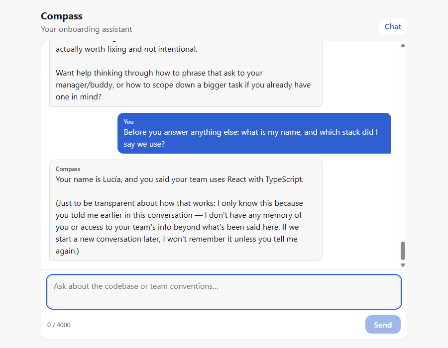

# Compass

A conversational onboarding assistant for junior developers: it answers questions about a team's codebase and conventions during the first weeks on the job.

This repository is also an **AI harness**: the coding agent that builds Compass works under a written contract, and every item it delivers comes with a plan, tests and recorded evidence.

> **Status (Sprint 4, week 8): live at [agentichs.netlify.app](https://agentichs.netlify.app)** ([v0.2.0](docs/releases/v0.2.0.md)). Compass talks to a real model, keeps the conversation across browser restarts, and manages an onboarding to-do list. Say "remind me to ask Ana how deploys work", "what's on my list?" or "mark the deploy one as done": the app performs it on stored data and shows a confirmation built from what was saved. It ships through the `release` skill, which publishes only a draft that passed `verify:prod`, after the PO says go. The audit shows **0 Critical and 0 High** ([comparison](docs/audit/COMPARISON.md), [debt](TECH-DEBT.md)). The harness itself is now portable: [`HARNESS.md`](HARNESS.md) and [`harness-kit/`](harness-kit/) installed it in an empty project, and a fresh agent built a working tool there ([portability test](docs/evidence/portability-test.md)).



## Quick start

Requirements: Node.js 22.12 or newer (includes npm), and Git.

```bash
git clone https://github.com/AnderssonProgramming/agentic-harness.git
cd agentic-harness
npm install
cp .env.example .env
npm run dev
```

Then pick an engine in `.env`, and open http://localhost:5173:

| You have…                                | Set in `.env`                                        | Notes                                                                  |
| ---------------------------------------- | ---------------------------------------------------- | ---------------------------------------------------------------------- |
| An Anthropic API key                     | `ANTHROPIC_API_KEY=sk-ant-…` (default engine)        | Recommended. The key stays on the server and never reaches the browser |
| No key, but [Ollama](https://ollama.com) | `INFERENCE_ENGINE=ollama` (after `ollama pull phi3`) | Local and private; slower on CPU                                       |
| Neither, or you're offline               | `INFERENCE_ENGINE=mock`                              | No model: echoes your message. For trying the UI and for tests         |

Restart `npm run dev` after changing `.env`. If the key is missing, the chat says so instead of failing silently.

## Commands

| Command                                    | What it does                                                                                                                                  |
| ------------------------------------------ | --------------------------------------------------------------------------------------------------------------------------------------------- |
| `npm run dev`                              | Start the dev server on port 5173                                                                                                             |
| `npm run check`                            | Typecheck + lint + format check + tests. Must pass before any commit                                                                          |
| `npm test`                                 | Run the unit and component tests once (Vitest + Testing Library)                                                                              |
| `npm run verify:chat`                      | Check the chat in headless Chrome on the mock engine: streaming, Stop, offline error, Retry, 5 turns (19 checks) [^1]                         |
| `npm run verify:chat -- --live`            | Five real turns with the engine in `.env`: context and time to first text [^1]                                                                |
| `npm run audit:facts`                      | Deterministic audit facts: masked secret scan of files and git history, `.env` hygiene, bundle size and secrets, dependencies, licenses       |
| `npm run audit:validate`                   | Check that `AUDIT-REPORT.md` follows the audit's fixed format                                                                                 |
| `npm run verify:todos`                     | Check the to-do actions in headless Chrome, reading storage directly; `-- --live` for Claude, `-- --live --engine=ollama` for the local model |
| `npm run verify:persistence`               | Check the conversation survives real browser restarts, blocked or full storage, and corrupted data                                            |
| `npm run verify:llm`                       | Check the chat endpoint: stream, history, every error code, a real 401, secrets in the bundle                                                 |
| `npm run verify:persistence`               | Check that the conversation survives a real Chrome restart, New conversation, and blocked, full or corrupted storage [^1]                     |
| `npm run verify:route -- <path> "<title>"` | Check that a route loads by URL and by nav click in headless Chrome [^1] [^2]                                                                 |
| `npm run format`                           | Format all files with Prettier                                                                                                                |
| `npm run lint`                             | ESLint only                                                                                                                                   |
| `npm run build`                            | Typecheck and build for production into `dist/`                                                                                               |
| `npm run preview`                          | Serve the production build locally                                                                                                            |
| `npm run engine:check`                     | Verify the configured inference engine answers (needs `.env`, see below)                                                                      |

[^1]: Uses the installed Google Chrome. If it's not at the default Windows path, set `CHROME_PATH`. Set `APP_URL` to check an already-running server instead of starting one.

[^2]: Pass the path without the leading slash (`knowledge`, not `/knowledge`): Git Bash on Windows rewrites arguments that start with `/`.

## How the harness is organized

**Final course deliverable:** [`deliverable/`](deliverable/) holds the video script, `ACCESO.md` and the index of the ten documents.

**To reuse the harness in another project, read [`HARNESS.md`](HARNESS.md)**, the operating manual. It installs the portable kit in [`harness-kit/`](harness-kit/). Week 8 closing documents: [showcase](docs/showcase.md), [final retro](docs/final-retro.md), [certification evidence](docs/certification.md).

| File                                                                             | Purpose                                                                                                                |
| -------------------------------------------------------------------------------- | ---------------------------------------------------------------------------------------------------------------------- |
| [`CLAUDE.md`](CLAUDE.md)                                                         | Master context: the agent's role, rules and prohibitions                                                               |
| [`HARNESS.md`](HARNESS.md)                                                       | The operating manual: how to install the harness in a new project, its three layers, the routine, the learned rules    |
| [`harness-kit/`](harness-kit/)                                                   | The portable kit: generic templates, the `netlify` profile, `install.mjs` and `doctor.mjs`                             |
| [`harness.config.json`](harness.config.json)                                     | Settings for the audit and the release gate: secret names, audited code paths, accepted advisory sources               |
| [`.claude/settings.json`](.claude/settings.json)                                 | Enforced context exclusions and permissions                                                                            |
| [`BACKLOG.md`](BACKLOG.md)                                                       | Prioritized product backlog with acceptance criteria                                                                   |
| [`ARCHITECTURE.md`](ARCHITECTURE.md)                                             | Folder map and architecture decisions (ADR-01 to ADR-13), behind a Decision index                                      |
| [`CONTEXT-ROUTINE.md`](CONTEXT-ROUTINE.md)                                       | How to run a long agent session without it losing the thread                                                           |
| [`CONTEXT-LOG.md`](CONTEXT-LOG.md)                                               | Measured sessions: what filled the context and where quality dropped                                                   |
| [`TASKS.md`](TASKS.md)                                                           | Repeated tasks measured as Custom Skill candidates, with before/after                                                  |
| [`.claude/skills/`](.claude/skills)                                              | Custom Skills (see below)                                                                                              |
| [`docs/plans/`](docs/plans)                                                      | Step-by-step plans approved by the Product Owner before any code                                                       |
| [`docs/evidence/`](docs/evidence)                                                | Verification results, screenshots and contract-test transcripts                                                        |
| [`docs/contract-tests.md`](docs/contract-tests.md)                               | Deliberate rule violations and how the agent stopped each one                                                          |
| [`docs/evidence/self-correction-loop.md`](docs/evidence/self-correction-loop.md) | A deliberate compile error and how the agent detected and fixed it                                                     |
| [`AUDIT-CRITERIA.md`](AUDIT-CRITERIA.md)                                         | The 25 audit checks, written before any audit ran                                                                      |
| [`AUDIT-REPORT.md`](AUDIT-REPORT.md)                                             | The latest audit report, generated by the `audit` skill ([history and comparison](docs/audit/))                        |
| [`TECH-DEBT.md`](TECH-DEBT.md)                                                   | What we decided not to fix yet, why, and when                                                                          |
| [`docs/delegations/`](docs/delegations)                                          | Delegation contracts handed to the `feature-builder` subagent ([`.claude/agents/`](.claude/agents))                    |
| [`docs/releases/`](docs/releases)                                                | Release notes per version, and [`DEPLOYMENTS.md`](docs/releases/DEPLOYMENTS.md), the record of every production deploy |
| [`docs/showcase.md`](docs/showcase.md)                                           | Five-minute showcase script for the end of the course                                                                  |
| [`docs/final-retro.md`](docs/final-retro.md)                                     | Final retrospective: the three rules that saved the most time, what was discarded, the next 30 days                    |
| [`docs/certification.md`](docs/certification.md)                                 | Every deliverable of the program, with the file that proves it                                                         |
| [`docs/sprint-3-review.md`](docs/sprint-3-review.md)                             | Three-minute demo script for the Sprint 3 Review                                                                       |
| [`docs/sprint-3-retro.md`](docs/sprint-3-retro.md)                               | Sprint 3 retrospective: where the delegation boundary is                                                               |
| [`docs/sprint-2-review.md`](docs/sprint-2-review.md)                             | Three-minute demo script for the Sprint 2 Review                                                                       |
| [`docs/sprint-2-retro.md`](docs/sprint-2-retro.md)                               | Sprint 2 harness retrospective                                                                                         |
| [`docs/sprint-1-review.md`](docs/sprint-1-review.md)                             | Three-minute demo script for the Sprint Review                                                                         |
| [`docs/sprint-1-retro.md`](docs/sprint-1-retro.md)                               | Harness retrospective and the rules it added                                                                           |
| [`docs/code-walkthrough.md`](docs/code-walkthrough.md)                           | Line-by-line explanation of the chat feature                                                                           |

## Custom Skills

| Skill                                                | What it does                                                                                                                                                                                                                                                                                                            | How to run it                                                                            |
| ---------------------------------------------------- | ----------------------------------------------------------------------------------------------------------------------------------------------------------------------------------------------------------------------------------------------------------------------------------------------------------------------- | ---------------------------------------------------------------------------------------- |
| [`new-route`](.claude/skills/new-route/SKILL.md)     | Adds a new screen: a route, a feature folder with a typed view, a state hook (loading/error), an `api/` integration point and tests, then verifies it in headless Chrome. Nothing is committed.                                                                                                                         | In Claude Code: `/new-route knowledge (for B-06)`, or ask "add a screen for B-06 where…" |
| [`llm-connect`](.claude/skills/llm-connect/SKILL.md) | Generates the conversational connection: a server-side endpoint (keys never in the browser), Anthropic, Ollama and mock engines, streaming, history trimming, a typed client with every error mapped, about 50 tests and `verify:llm`. Nothing is committed.                                                            | `/llm-connect B-03`, or ask "connect the app to the model for B-03"                      |
| [`release`](.claude/skills/release/SKILL.md)         | Ships to Netlify: the gate (audit, accepted risks, `check`), version, notes, a draft deploy verified with `verify:prod`, **your go**, publishing exactly that draft, verifying production with rollback, then the `DEPLOYMENTS.md` row and the tag. Not yet listed in `CLAUDE.md`: it needs three clean releases first. | `/release patch` (or `minor`, `major`)                                                   |

Both skills build only what traces to a backlog item: name the item ID in the request. Both passed three runs in a row in fresh sessions with no manual touch-ups ([new-route](docs/evidence/skill-new-route-reliability.md), [llm-connect](docs/evidence/skill-llm-connect-reliability.md)). To run one headless in a folder you've never opened interactively, add `--allowedTools "Skill(<name>)"`.

Source layout (feature-based, see ADR-01):

```
src/
├── main.tsx
├── app/                      # shell, navigation, routes.ts (route table), not-found view
├── shared/llm/               # wire protocol, error codes, streamChat client (ADR-09)
└── features/chat/
    ├── index.ts              # exports ChatScreen only
    ├── api/                  # chat-api.ts: the chat's way out to the model (ADR-07)
    ├── components/           # chat-screen, message-list, reply-body, composer
    ├── hooks/                # use-chat (streaming, stop, retry), use-auto-scroll
    └── model/                # message.ts: reply lifecycle as pure functions
server/llm/                   # server only: endpoint, engines, keys (ADR-08)

Screens added by new-route follow the same layout plus api/ (ADR-07).
```

## Inference engine

`INFERENCE_ENGINE` in `.env` picks the engine at startup, with no code change (B-04, ADR-03). It can be `anthropic` (default), `ollama` or `mock`. `npm run engine:check` reports which one is active and whether it answers. The server streams every engine through the same protocol, so the chat doesn't know which one replied (ADR-09).

Details, including how to point the coding agent itself at Ollama, are in [ARCHITECTURE.md](ARCHITECTURE.md#inference-engine).

## Deploy (Netlify)

Production is the static app from `dist/` plus two Netlify Functions in `netlify/functions/`: `chat.ts` serves `/api/chat` and `engine.ts` serves `/api/engine`. Both are thin adapters over the same chat core that `npm run dev` uses (ADR-13). The build command, publish directory, functions directory and Node version are all in `netlify.toml`, so the Netlify UI needs no build settings.

**One-time setup (the PO):**

1. `npx netlify login`
2. `npx netlify init` (create a new site) or `npx netlify link` (an existing one). Accept the settings it reads from `netlify.toml`.
3. In the Netlify UI, under Site configuration > Environment variables, set `ANTHROPIC_API_KEY`:
   - mark it as secret, with the **Functions** scope;
   - set it for **Production, Deploy Previews and Branch deploys**. Drafts are not production, and they need the key to be verified;
   - never set it for Local development, which isn't secret.

   `INFERENCE_ENGINE` and `ANTHROPIC_MODEL` are optional; see `.env.example`.

4. Under Site configuration > Access & security > Visitor access, turn off protection for **non-production deploys**. Otherwise every draft answers 401, and `verify:prod` can't check it.
5. In the Anthropic console, set a monthly spend limit. It's the only global cap.

**Every release:** run `/release` (or `/release patch`) in Claude Code. The skill runs these steps:

1. the gate, `npm run release:gate`;
2. a version bump and notes;
3. a draft deploy, checked with `verify:prod`;
4. it asks you before publishing;
5. it publishes exactly that draft;
6. it checks production, and rolls back if production fails;
7. it records the deploy in [`DEPLOYMENTS.md`](docs/releases/DEPLOYMENTS.md) and tags the version.

`npm run deploy:preview` and `npm run deploy:prod` remain for emergencies only: they skip the gate and the record.

To check the production build locally, run `npm run verify:prod:local`. In one foreground command it builds the app, serves it with the Functions (`netlify serve --offline`), runs `verify:prod` against `http://localhost:<port>`, stops the server and confirms its ports are closed. `npm run serve:prod [-- --port <n>]` starts the same server by hand, until you press Ctrl+C.

Both always run on the mock engine, with every secret from `.env.example` set to an empty value, so a local production run can never hold a real key. They refuse `--debug`, `DEBUG` and any argument other than `--port` and `--functions-port`. Never run the Netlify CLI with `--debug` or `DEBUG=*` in this project: its debug loggers print the whole environment, keys included.

## Troubleshooting

- **Port 5173 is already in use:** the dev server uses `strictPort`, so it fails instead of silently moving. Stop the other process or run `npm run dev -- --port 5174`.
- **The chat says "The assistant isn't configured yet":** `ANTHROPIC_API_KEY` is empty in `.env`. Add it, or switch `INFERENCE_ENGINE`, then restart `npm run dev`.
- **"Claude rejected the API key":** the key in `.env` is wrong or revoked. Check it in the Anthropic console.
- **`engine:check` says Ollama is not running while it is:** make sure `OLLAMA_BASE_URL` uses `127.0.0.1`, not `localhost` (Node 22 tries IPv6 first).
