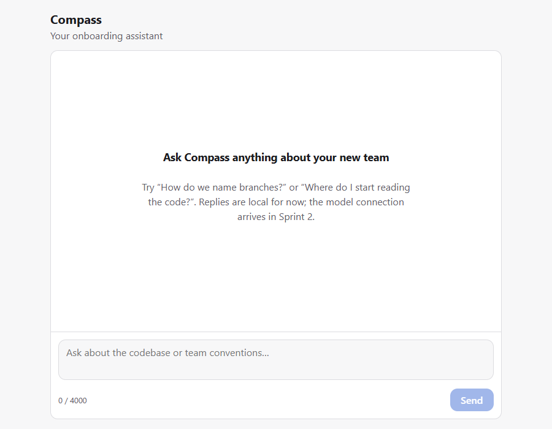
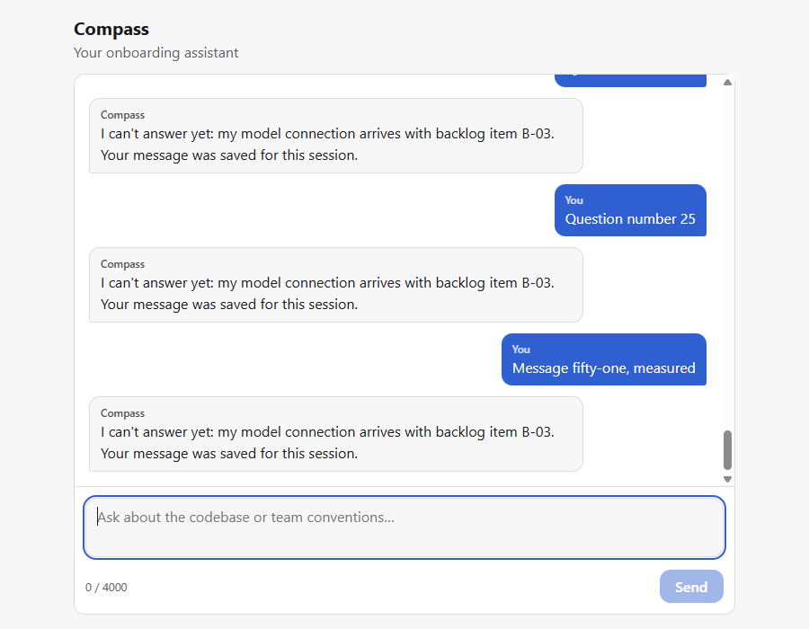
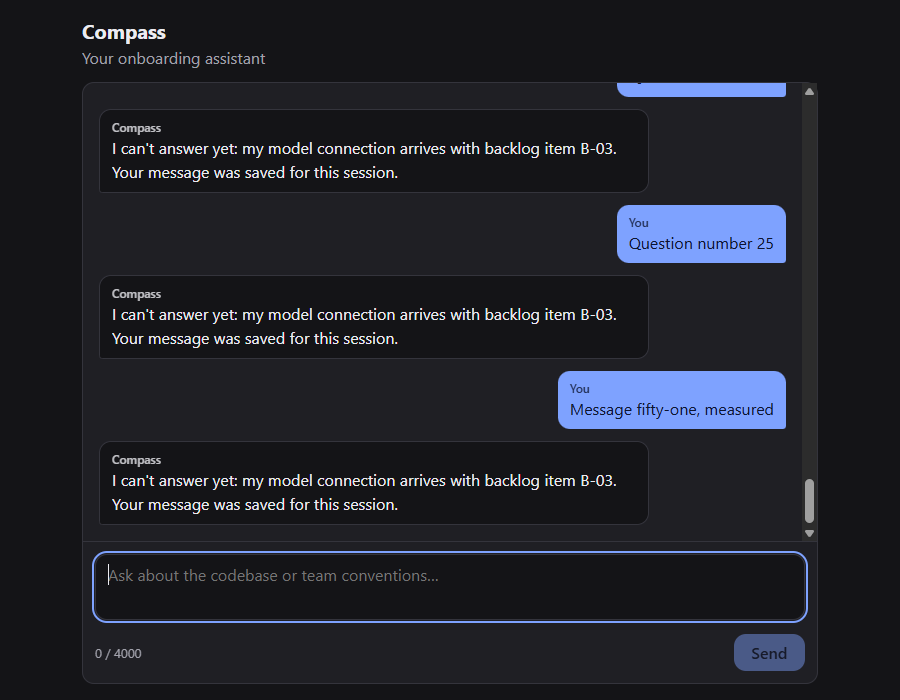

# B-01 / B-02 verification

Date: 2026-09-30. Browser: headless Chrome 154.0.8037.58, 900×700 viewport.
Reproduce: `npm run dev`, then in a second terminal `npm run verify:chat` (script: [`scripts/verify-chat.mjs`](../../scripts/verify-chat.mjs)).

The script types with real DevTools-protocol key events (`Enter`, `Shift+Enter`), reads the DOM and computed styles, and exits non-zero if any criterion fails. The same criteria are also covered by 20 unit and component tests in `npm test`.

## Results

| Criterion                                                     | Result | Measured                                                                    |
| ------------------------------------------------------------- | ------ | --------------------------------------------------------------------------- |
| B-01: typed message appears at the bottom after sending       | Pass   | 2 items after the first send, the last user message is the typed text       |
| B-01: user and assistant messages are visually distinct       | Pass   | user `rgb(47, 95, 208)` right-aligned; assistant `rgb(247, 247, 248)` left  |
| B-01: list auto-scrolls to the newest message                 | Pass   | `scrollTop` equals the maximum (3902 px) after the 52nd message             |
| B-01: messages persist while the tab is open                  | Pass   | 52 messages present after 26 sends, no reload                               |
| B-01: with 50 messages, a new send renders in < 100 ms        | Pass   | **11.9 ms** from `keydown` to the next frame after the new item is inserted |
| B-01: empty state explains what to do                         | Pass   | Heading "Ask Compass anything about your new team"                          |
| B-02: `Enter` sends, `Shift+Enter` inserts a new line         | Pass   | Draft and sent text are both `line one\nline two`                           |
| B-02: empty or whitespace-only drafts are not sent            | Pass   | Send disabled; `Enter` leaves the list at 2 items                           |
| B-02: input cleared and keeps focus after sending             | Pass   | `value === ''` and the textarea is `document.activeElement`                 |
| B-02: over 4,000 characters is blocked with a visible counter | Pass   | Send disabled, counter reads "Too long: 4001 / 4000"                        |
| No console errors or uncaught exceptions                      | Pass   | none                                                                        |

## Screenshots

| Empty state                          | Conversation (light)                                      | Conversation (dark)                                     |
| ------------------------------------ | --------------------------------------------------------- | ------------------------------------------------------- |
|  |  |  |

## Issues found while building

- **Enter bypassed the disabled Send button.** The composer test `disables Send for empty and whitespace-only drafts` failed: pressing `Enter` on a whitespace-only draft still called `onSend("   ")`. Fixed by guarding `submit()` with the same `checkDraft` result that disables the button.
- **Deprecated type caught by the linter.** `FormEvent` is deprecated in the React 19 types; `typescript-eslint`'s `no-deprecated` rule failed the check and it was replaced with `SubmitEvent`.
