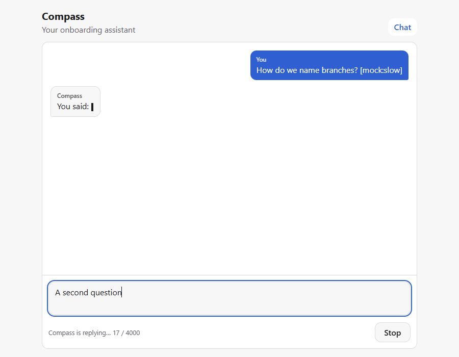
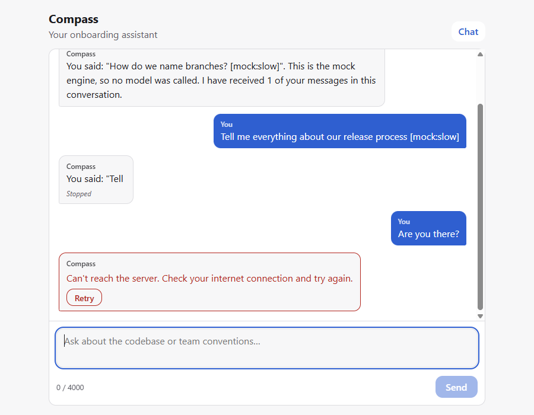
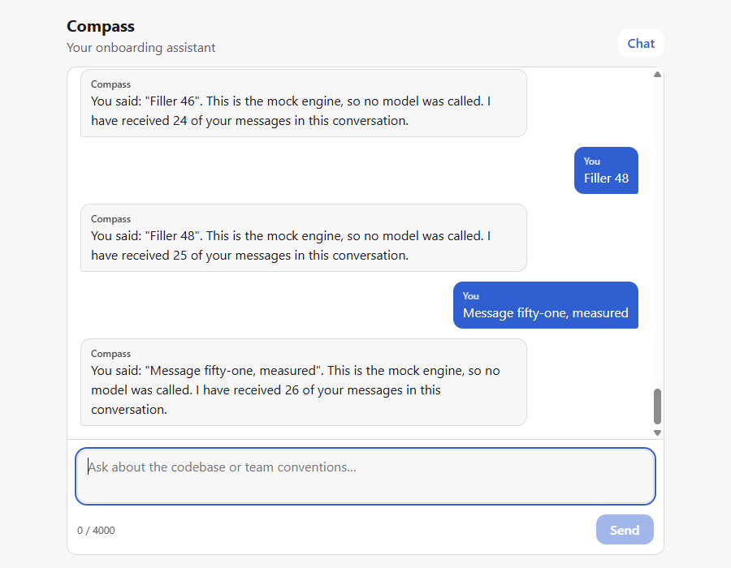
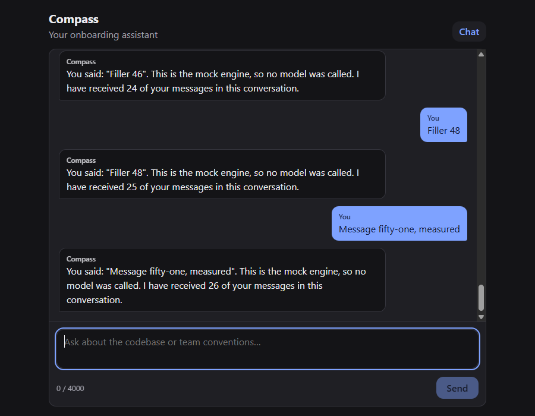

# B-03, B-04, B-05, B-09: the chat talks to the model

Date: 2026-10-01. Browser: headless Chrome/154.0.8037.58. Reproduce:

- `npm run verify:chat`: mock engine, deterministic, no API cost
- `npm run verify:chat -- --live`: five turns with the engine in `.env` (Claude)
- `npm run verify:llm`: the endpoint itself, including a real 401 and a scan of the production bundle

Both browser scripts start their own dev server. Network failure is real: Chrome's DevTools `Network.emulateNetworkConditions({ offline: true })`, not a mocked fetch.

## Week-4 chat criteria

| Criterion                                                 | Evidence                                                                                                           |
| --------------------------------------------------------- | ------------------------------------------------------------------------------------------------------------------ |
| C1 a message is sent and the model's reply arrives        | mock C1; live C1, 5/5 turns `done`                                                                                 |
| C2 visible loading indicator while waiting                | mock C2: typing indicator plus `aria-busy`                                                                         |
| C3 input handled, no double send                          | mock C3: Send becomes Stop, and a second Enter sends nothing while the draft is kept                               |
| C4 network down → understandable error, app keeps working | mock C4 and B-05 (Retry after reconnecting)                                                                        |
| C5 at least five turns with context                       | live C5: turn 5 recalls the name (turn 1) and the stack (turn 2); mock C5: the engine received all 5 user messages |
| C6 history kept while the app is open                     | mock C6: 52 messages; live C6: 10                                                                                  |

## Mock run (`npm run verify:chat`): 19/19 pass

| ID      | Criterion                                                              | Result | Measured                                                                                                           |
| ------- | ---------------------------------------------------------------------- | ------ | ------------------------------------------------------------------------------------------------------------------ |
| B-01 #6 | Empty state explains what to do                                        | Pass   | heading: "Ask Compass anything about your new team"                                                                |
| C2      | A loading indicator is visible while waiting                           | Pass   | {"typing":true,"ariaBusy":"true"}                                                                                  |
| B-02 #3 | Input cleared and keeps focus after sending                            | Pass   | {"value":"","focused":true}                                                                                        |
| C3      | Send becomes Stop and a second message cannot be sent on top           | Pass   | {"users":1,"stop":true,"draftKept":"A second question"}                                                            |
| B-09    | The reply appears progressively, not all at once                       | Pass   | 8 distinct lengths while streaming: 15 → 21 → 36 → 55 → 62 → 75 → 81 → 99                                          |
| C1      | The reply arrives under the message                                    | Pass   | You said: "How do we name branches? [mock:slow]". This is the mock engine, so no                                   |
| B-09    | Stop interrupts the reply and keeps the partial text                   | Pass   | 16 chars kept, status stopped                                                                                      |
| C4      | Network down: an understandable error, and the app keeps working       | Pass   | {"alert":"Can't reach the server. Check your internet connection and try again.Retry","retry":true,"usersKept":3}  |
| B-05    | Retry after reconnecting gets the reply, and the user message was kept | Pass   | You said: "Are you there?". This is the mock engine, so no m                                                       |
| B-05    | API errors are explained; Retry only when retrying can help            | Pass   | {"rateLimit":"Too many requests right now. Wait a few seconds and try again.Retry","authRetry":false}              |
| B-01 #2 | User and assistant messages are visually distinct                      | Pass   | {"user":{"bg":"rgb(47, 95, 208)","align":"flex-end"},"assistant":{"bg":"rgb(247, 247, 248)","align":"flex-start"}} |
| B-02 #2 | Whitespace-only drafts are not sent                                    | Pass   | users 5 → 5                                                                                                        |
| B-02 #1 | Shift+Enter inserts a new line                                         | Pass   | "line one\nline two"                                                                                               |
| B-02 #4 | Over 4,000 characters is blocked with a visible counter                | Pass   | {"disabled":true,"counter":"Too long: 4001 / 4000"}                                                                |
| C5      | Five turns: on turn 5 the model receives all five user messages        | Pass   | model received 5 user messages; 5 on screen                                                                        |
| B-01 #5 | With 50 messages, a new send renders in < 100 ms                       | Pass   | 8.6 ms                                                                                                             |
| B-01 #3 | The list follows the newest message                                    | Pass   | at bottom: true                                                                                                    |
| C6      | The history stays while the app is open                                | Pass   | 52 messages on screen                                                                                              |
| —       | No console errors or exceptions                                        | Pass   | none                                                                                                               |

## Live run with Claude (`npm run verify:chat -- --live`): two runs in a row

| Run | C1   | C5   | First text after Enter, per turn            | Result   |
| --- | ---- | ---- | ------------------------------------------- | -------- |
| 1   | Pass | Pass | 1105 ms, 1508 ms, 1607 ms, 1068 ms, 1203 ms | all pass |
| 2   | Pass | Pass | 1180 ms, 1682 ms, 1446 ms, 1522 ms, 1157 ms | all pass |

**About the 2-second criterion (B-09).** The first live run measured turn 1 at 2107 ms and failed. That measurement started before typing the message and polled the page every 100 ms, so it counted the script, not the app. The script now measures in the page, from the Enter keydown to the first painted text (the same method as the B-01 render check). Measured that way, both later runs pass on every turn (1.07–1.68 s). The failed measurement is kept here because it's part of the evidence.

### Run 1 transcript (replies shortened)

**Turn 1** (1105 ms to first text)

> Hi! My name is Lucía and this is my second week as a frontend developer.

Hi Lucía, welcome (again) to week two)! Glad you reached out. Just so you know upfront: I don't have access to your team's actual codebase, docs, or Slack history, so I can't tell you "here's how your team does X" or "ask so-and-so about Y." What I _can_ do is help you think through frontend concepts, patterns, debugging approaches, general conventions (like common React/JS/CSS practices), and help you figure out goo …

**Turn 2** (1508 ms to first text)

> Our team uses React with TypeScript. What should I focus on learning first?

Good question to start with — React + TypeScript is a big combo, so let's narrow down what'll actually be useful _this week_ versus stuff you can pick up gradually. Since I don't know your specific codebase, I'll give you a general priority order, and then suggest how to find out what _your team_ actually leans on. **1. TypeScript basics as they show up in React, not TS in the abstract** Don't go learn generics and c …

**Turn 3** (1607 ms to first text)

> Thanks. How do I ask a senior for a code review without bothering them?

This is such a common worry for junior devs, and honestly, asking for reviews is _literally part of a senior's job_ — so you're not bothering them, you're doing exactly what's expected. But I get that it feels different when you're new. Here's how to make the ask smooth and low-friction for both of you: **1. Make the review easy to do, not just easy to ask for** Before you ping anyone: - Make sure the PR description …

**Turn 4** (1068 ms to first text)

> What is a good first pull request for someone new?

Great question to think about proactively. Since I don't have visibility into your team's actual backlog or ticket system, I can't point you to a specific task — but I can tell you what makes a _good_ first PR in general, so you can recognize one when you see it (or ask for one). **Traits of a good first PR:** 1. **Small and self-contained** — touches 1-3 files, not 20. Easy for you to reason about, easy for a review …

**Turn 5** (1203 ms to first text)

> Before you answer anything else: what is my name, and which stack did I say we use?

Your name is Lucía, and you said your team uses React with TypeScript. (Just to be transparent: I don't have memory beyond this conversation — so I know this because you told me earlier in our chat, not because I have any separate record of you or your team.)

## Screenshots

| Streaming (Send became Stop, next draft kept) | Network down, then Retry                 | Turn 5 with Claude                               |
| --------------------------------------------- | ---------------------------------------- | ------------------------------------------------ |
|               |  |  |

| Light                                               | Dark                                              |
| --------------------------------------------------- | ------------------------------------------------- |
|  |  |

## Defects found while verifying

- **Mock markers fired again after merges** (`4216f77`): after a failed reply, the server merges the next message into the unanswered one, and an old `[mock:auth]` kept failing every later question. The mock now reads only the newest message.
- **Client timeout never fired against a stream that ignored aborts**: the reader now cancels itself on abort (found by the client tests while building the skill).
- **Leaked abort listeners in the mock engine** (one per word): found as a `MaxListenersExceededWarning` and fixed before the skill was captured.

## B-04: switching to the local engine by environment variable only

Same code, started with `INFERENCE_ENGINE=ollama npx vite`, then a three-turn history posted to `/api/chat`:

```
{"type":"start","engine":"ollama","model":"phi3"}
… 7 delta events …
{"type":"done"}
reply: "Your name is Luc�a."   (17.6 s on CPU with phi3)
```

The reply uses the history, so the switch needed no code change. The `�` is an encoding artifact of the test request, which was typed as a `curl` argument in a Windows shell. The browser sends UTF-8, and the Claude transcript above shows "Lucía" correctly. `npm run engine:check` (Sprint 1) still reports the active engine.

## B-03: the key never reaches the browser

`npm run verify:llm`, run during the first real generation on `main`, built the production bundle into a temporary folder and scanned every file for `ANTHROPIC_API_KEY`, `sk-ant-` and the real key value: clean. The key is read only by `server/llm/engine.ts` (ADR-08).
