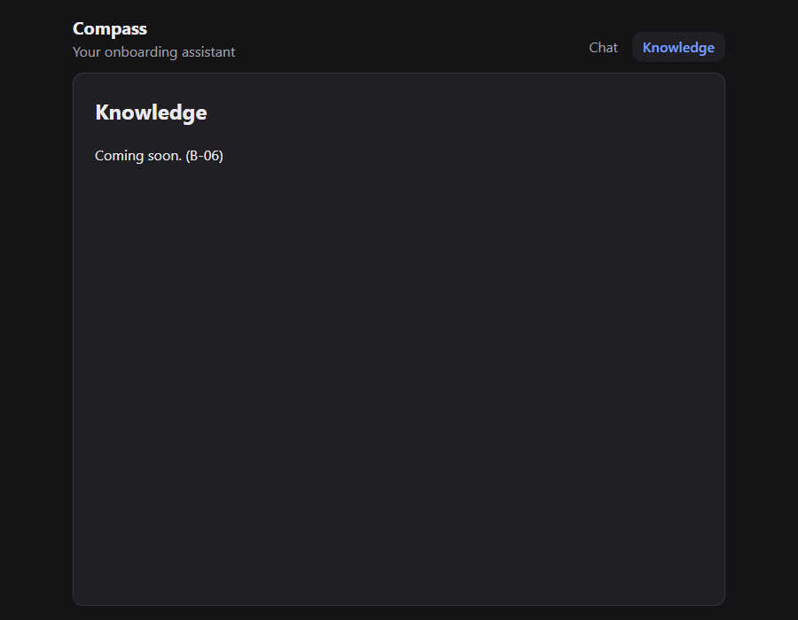
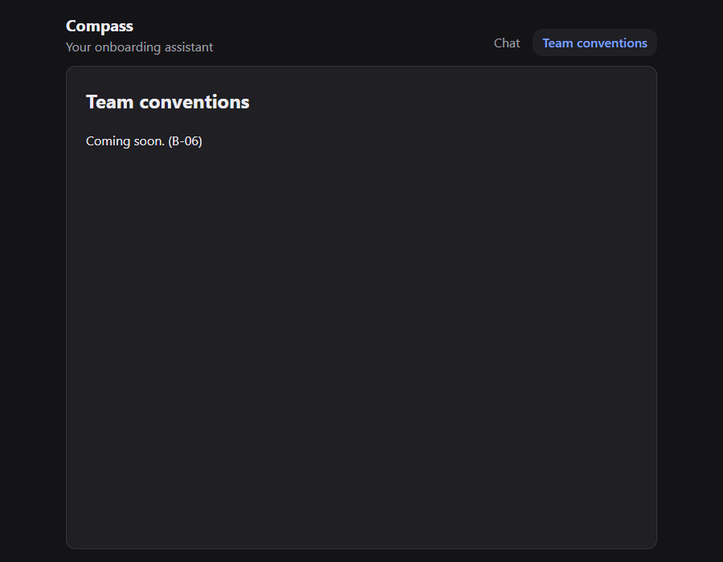
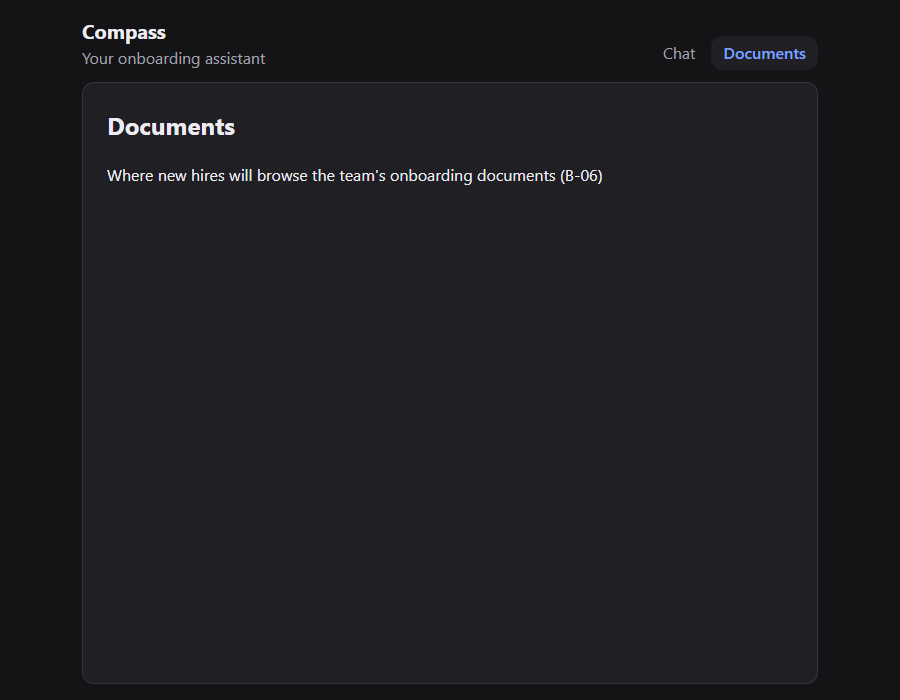

# new-route: reliability test

Criterion (Sprint 2, item 2.2): one command produces the complete result **three times in a row, with no manual touch-ups**.

Method for every run:

1. Fresh `git clone` of the repository into a scratch folder, then `npm ci`. No state carries over from any other run.
2. A fresh headless session in that clone: `claude -p "<invocation>" --allowedTools "Skill(new-route)" --output-format stream-json`. The `--allowedTools` flag is the headless equivalent of clicking "Allow" once for the skill (see the skill's known errors). Every tool call is logged.
3. **Independent re-verification by the harness, not the agent's word**: `git status`, `npm run check`, and `npm run verify:route` on the route the agent actually registered (read from the `routes.ts` diff).

Nothing was edited by hand in any clone. Screenshots below are from the independent verification.

## Current passing series (series 4): skill at commit `824ea24`

| Run 1                              | Run 2                              | Run 3                              |
| ---------------------------------- | ---------------------------------- | ---------------------------------- |
|  |  |  |

Between series 3 and 4, a confirmation run in the **main repository folder** (trusted, no extra flags) refused a request "for B-06" that the clone sessions had accepted, because B-06's criteria don't describe a screen. The scope check was a judgment call, so `824ea24` made it mechanical: a named item ID that exists and isn't done is enough, and a mismatch is reported without stopping. Changing the skill restarted the test.

| Run | Condition                            | Invocation                                                                           | Agent time | Result                                                                                             |
| --- | ------------------------------------ | ------------------------------------------------------------------------------------ | ---------- | -------------------------------------------------------------------------------------------------- |
| 1   | Slash command, defaults              | `/new-route knowledge (for B-06)`                                                    | 131 s      | ✅ `/knowledge`: check pass, verify 6/6, only generator files                                      |
| 2   | Slash command, custom path and title | `/new-route team-conventions conventions "Team conventions" (for B-06)`              | 140 s      | ✅ `/conventions`: check pass, verify 6/6                                                          |
| 3   | Natural language                     | "Add a screen for B-06 where new hires will browse the team's onboarding documents." | 132 s      | ✅ derived `/documents` "Documents": check pass, verify 6/6                                        |
| –   | Negative: existing screen            | `/new-route chat /`                                                                  | 13 s       | Stopped, nothing changed                                                                           |
| –   | Negative: no backlog item named      | `/new-route knowledge`                                                               | 17 s       | Stopped, quoted the rule, pointed at B-06 as the nearest item without assuming it. Nothing changed |

No permission denials or tool errors in any run. Cost: USD 0.21–0.36 per run.

**Trusted-folder confirmation (closes last week's open item):** in the main repository with **no** `--allowedTools` flag, the natural-language request launched the skill through `Skill(new-route)`, ran all five commands with zero permission denials, passed check and verify, and reported the B-06 mismatch without stopping. The generated files were removed afterwards, because no backlog item puts that screen on `main`.

**Open observation:** from the same sentence, series 3 derived `onboarding-documents` and series 4 derived `documents`. Both are valid and both are reported to the PO as derived inputs, but the "main noun" rule still leaves room for interpretation. Candidate hardening for Sprint 3: "use the full noun phrase, modifiers included".

## Earlier passing series (series 3): skill at commit `19308ac`

| Run | Condition                                             | Invocation                                                                           | Agent time | Result                                                                                      |
| --- | ----------------------------------------------------- | ------------------------------------------------------------------------------------ | ---------- | ------------------------------------------------------------------------------------------- |
| 1   | Slash command, all defaults                           | `/new-route knowledge (for B-06)`                                                    | 146 s      | ✅ `/knowledge` "Knowledge": check 37/37 tests, verify 6/6, only generator files changed    |
| 2   | Slash command, multi-word name, custom path and title | `/new-route team-conventions conventions "Team conventions" (for B-06)`              | 156 s      | ✅ `/conventions` "Team conventions": check 37/37, verify 6/6, only generator files changed |
| 3   | Natural language, no slash command                    | "Add a screen for B-06 where new hires will browse the team's onboarding documents." | 155 s      | ✅ derived `/onboarding-documents` "Onboarding Documents": check 37/37, verify 6/6          |

All three ran the same 5 skill commands in the same order: generator → `format` → `check` → `verify:route` → `git status`. Cost per run: USD 0.33 / 0.38 / 0.48.

Note on run 3: before launching the skill, the agent tried to explore the repository with a chained `cd … && cat …`. The deny rules blocked it, and it continued with plain reads. It wasn't a skill step and needed no human action, but it shows why the skill says "plain commands only".

### Negative run (same skill commit)

`/new-route chat /`: the agent stopped at step 1 in 16 s, citing three reasons (path `/` is registered, `src/features/chat/` exists, the root path is never allowed). No files changed.

## How it got there: the series that failed

These are the evidence that the test did its job. Each failure became a step, an input rule or a known error, never a manual fix.

### First run (commit `538e07e`)

| What happened                                                                                                | Change                                                                    |
| ------------------------------------------------------------------------------------------------------------ | ------------------------------------------------------------------------- |
| The Skill tool and the generator were denied ("requires approval"), so the agent stopped and changed nothing | `.claude/settings.json` allow list (`32451ec`)                            |
| The agent prefixed a command with `cd … &&`, so it no longer matched any rule                                | New step rule: plain commands from the repo root, no chaining (`32451ec`) |
| The runner itself passed `/new-route` through Git Bash, which rewrote it to `C:/Program Files/Git/new-route` | Known error added. The runner uses `MSYS_NO_PATHCONV=1`                   |

The rerun passed (check and verify 6/6).

### Series 1 (commit `32451ec`): 2 of 3

| Run | Result                                                                                                                                                                                                  |
| --- | ------------------------------------------------------------------------------------------------------------------------------------------------------------------------------------------------------- |
| 1   | ✅ But the agent **invented** a purpose sentence, where the earlier run had used the default. Same structure, different content.                                                                        |
| 2   | ✅                                                                                                                                                                                                      |
| 3   | ❌ "Add a settings screen where the user will pick the inference engine." The Skill tool was denied **despite** the allow list, and the agent also flagged that the request contradicts ADR-03 and B-04 |

A probe in the same clone with `--allowedTools "Skill(new-route)"` launched the skill with zero denials. That's where the finding came from: in a folder never opened interactively, the project's **allow** rules weren't applied, but its **deny** rules were.

Changes (`f815cb3`, `ee7e527`):

- `purpose` must be the user's words or exactly `Coming soon.`
- Contradicting an ADR, and having no backlog item, are now explicit stop conditions.
- New contract rule: an approved skill is an approved **plan**, never approved **scope**.
- Known error added for the never-opened-clone permission behavior.

### Series 2 (commit `19308ac`): 1 of 3, because the tests were wrong

Runs 1 and 2 (`/new-route knowledge`, `/new-route team-conventions …`) **stopped correctly**. No backlog item describes those screens, so the agent drafted a B-11 item and asked, as the new scope rule requires. Run 3 named B-06 and passed.

The skill was right and the test prompts were missing a named backlog item. Series 3 kept the skill unchanged and only added "(for B-06)" to the invocations, which is how the PO actually uses it.

## What this proves, and what it doesn't

- **Proven:** the same command produces the same eight files, the same route registration and passing checks across three conditions, in fresh sessions, with no human in the loop. Across all series it also refuses to act on conflicts, missing scope and existing screens.
- **Confirmed since:** in the trusted main folder the project allow rules apply, and no `--allowedTools` flag is needed (series 4 section).
- **Not proven:** that derived names are stable across sessions (see the open observation).
